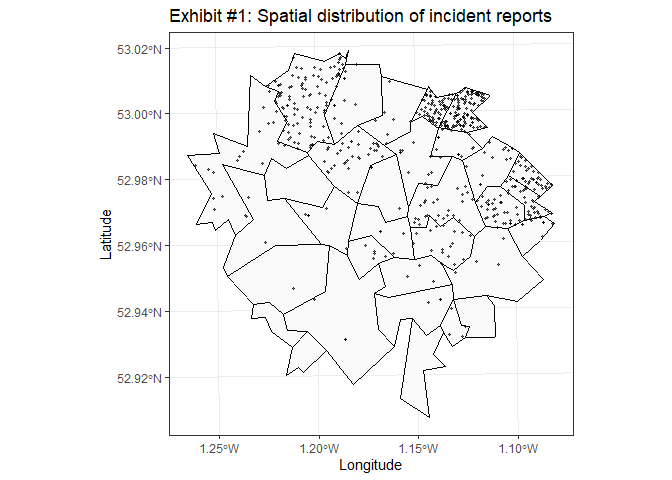
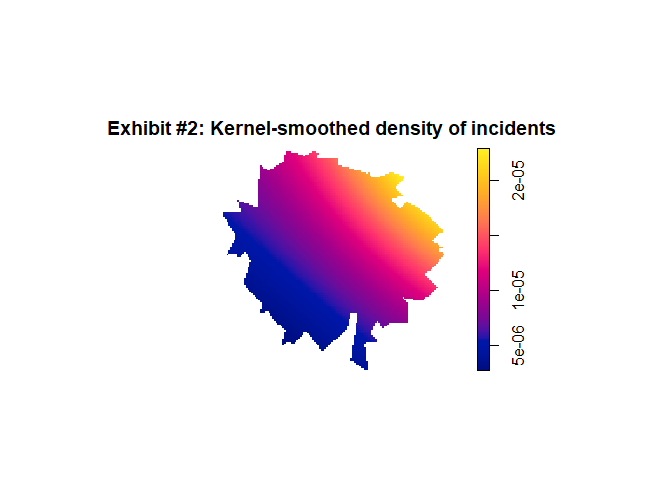
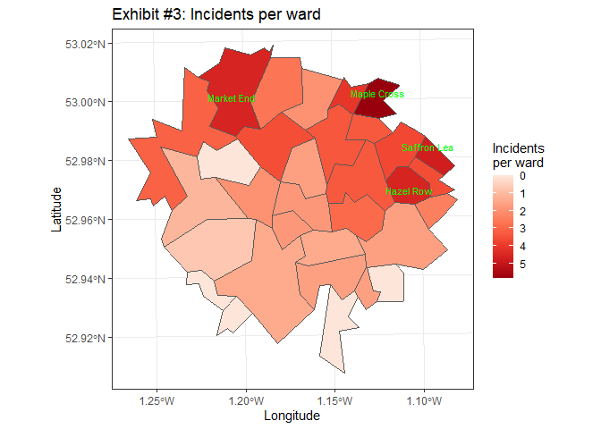
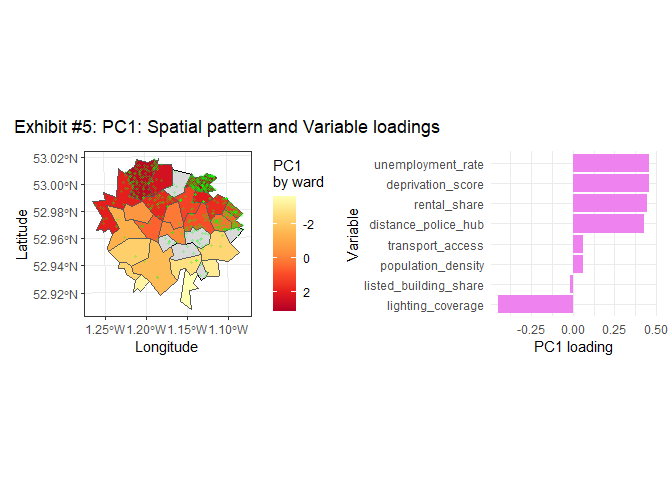

# Coursework 2


<!--- DO NOT DELETE THIS LINE --->

<!--- METADATA ANCHOR: MA22019-CW2-2026 --->

# Data Preparation Notes

<!--- DO NOT DELETE THIS LINE - DATA PREPARATION NOTES ANCHOR --->

``` r
# packages
library(tidyverse)
library(sf)
library(ggspatial)
library(prettymapr)
library(patchwork)
library(spatstat)
library(janitor)

# loading data
city_wards <- read_sf("data/city_wards.shp")
ward_profiles <- read.csv("data/ward_profiles.csv")
incident_reports <- read.csv("data/incident_reports.csv")
```

``` r
ward_profiles <- ward_profiles %>% 
  mutate(ward_name = gsub("-", " ", ward_name)) %>% 
  mutate(rental_share = as.numeric(gsub("%","",rental_share)))

ward_profiles_missing <- ward_profiles %>% 
  summarise(across(everything(), ~sum(is.na(.))))
```

The data was checked for inconsistent formatting in any variables.
“ward_name” is inconsistent, as some have hyphens in ward_profiles but
not in city_wards. “rental_share” in ward_profiles has inconsistent use
of % sign. These were removed and then the values were asserted to be
numeric.

In ward_profiles there are 3 missing “transport_access” values and 3
missing “listed_building_share” values. These have been kept to avoid
losing data unnecessarily in other variables, and will be deal with
seperately when doing specific analysis.

``` r
city_wards_profiles <- city_wards %>% 
  left_join(ward_profiles, by = c("ward_id", "ward_name"))
```

The ward geometries and info were joined by ward_id and ward_name, as
these now match after data cleaning. left_join() was used in order to
keep all 32 ward geometries, and add info from ward_profiles without
risk of losing anything.

``` r
incident_sf <- st_as_sf(incident_reports, coords = c("x", "y"), crs = st_crs(city_wards_profiles)) 

incidents_wards <- st_join(incident_sf, city_wards_profiles)

no_mislabelled_incidents <- incidents_wards %>% 
  filter(ward_name.x != ward_name.y) %>% 
  nrow()    # 39 mislabelled incidents.
```

Incident reports were joined to the their wards by geometry by
st_join(). Some labels given on the reports were found to be inaccurate,
with 39 mislabels compared to coordinates given.

``` r
cat("No. incident reports with mislabelled wards:", no_mislabelled_incidents, "\n")
```

    No. incident reports with mislabelled wards: 39 

``` r
incidents_wards <- incidents_wards %>% 
  rename(ward_recorded = ward_name.x, correct_ward = ward_name.y)
```

Throughout analysis raw coordinates were used as they were more likely
to be accurate than labels, as they are less prone to data entry issues
or confusion near borders.

Scales of each variable were interpreted: - unemployment_rate (%) -
deprivation_score (0-100) i.e. higher score higher deprivation -
rental_share (%) - population_density (people/mile^2) - transport_access
(% people with transport accessible by foot) - lighting_coverage (%
roads/paths covered by streetlamps) - distance_police_hub (miles) -
listed_building_share (%)

# Task 1

<!--- DO NOT DELETE THIS LINE - TASK 1 ANCHOR --->

``` r
# Write your Task 1 code here.

incidents_per_ward <- incidents_wards %>% 
  st_drop_geometry() %>% 
  count(correct_ward, name = "n_incidents")

top_incidents_per_ward <- incidents_per_ward %>% 
  arrange(desc(n_incidents)) %>% 
  head(8)

incidents_per_ward_plot <- top_incidents_per_ward %>% 
  ggplot(aes(x = reorder(correct_ward, n_incidents), y = n_incidents)) +
  geom_col(fill = "violet") +
  coord_flip() +
  labs(
    x = "Ward",
    y = "Number of incidents",
    title = "Top 8 wards by incident count") +
  theme_minimal()
```

Incidents per ward were computed: there was significant variation
between wards, with some wards such as “Canal Side” having no incidents,
and others having many incidents such as “Maple Cross” with 337.

``` r
spatial_distribution_incidents <- incidents_wards %>% 
  ggplot()+
  geom_sf(data = city_wards, fill = "grey98", colour = "black")+
  geom_sf(data = incidents_wards, alpha = 0.6, size = 0.6, colour = "black")+
  theme_bw()+
  labs(title = "Spatial distribution of incident reports", x = "Longitude", y = "Latitude")

spatial_distribution_incidents
```



Spatial distribution of incidents was plotted to see trends.

``` r
incident_ppp <- ppp(
  st_coordinates(incidents_wards)[,1],
  st_coordinates(incidents_wards)[,2],
  window = as.owin(city_wards))

density_map <- density.ppp(incident_ppp, edge = TRUE, sigma = 4000)
plot(density_map, main = "Kernel-smoothed density of incidents")
```



Kernel-smoothed density showed the incidents most densely occurred in
the North-East. Sigma=4000 was found to be optimal.

A Choropleth map to investigate incidents per ward was plotted:

``` r
areas_counts <- city_wards_profiles %>% 
  left_join(incidents_per_ward, by = c("ward_name" = "correct_ward")) %>% 
  mutate(n_incidents = replace_na(n_incidents, 0))

top_ward <- areas_counts %>% 
  slice_max(n_incidents, n = 3)

choropleth_map1 <- areas_counts %>% 
  ggplot(aes(fill = (log(n_incidents+1)))) +
    geom_sf() +
    geom_sf_text(data = top_ward, aes(label = ward_name), size = 3, colour = "green")+
    theme_bw() +
    scale_fill_distiller(palette = "Reds", trans = "reverse") +
    labs(
        x = "Longitude", y = "Latitude",
        fill = "Incidents\nper ward",
        title = "Incidents per ward")
choropleth_map1
```



When joining incident counts to the wards, there were some NAs as some
wards had 0 incidents reported, hence these were replced by 0s. A log
scale was added on the incidents to improve readability (and adjusted to
avoid log0), as Maple Cross was significantly higher than the rest.
Again there are greater numbers of incidents in the North, and there are
hotspots in the East and North-west.

# Task 2

<!--- DO NOT DELETE THIS LINE - TASK 2 ANCHOR --->

``` r
# Write your Task 2 code here.

correlation_matrix <- areas_counts %>% 
  st_drop_geometry() %>% 
  select(n_incidents, unemployment_rate, deprivation_score, rental_share,
         population_density, transport_access, lighting_coverage,
         distance_police_hub, listed_building_share) %>% 
  cor(use = "complete.obs") 

incident_correlations <- tibble(
  variable = names(correlation_matrix["n_incidents", ]),
  correlation = as.numeric(correlation_matrix["n_incidents", ])) %>% 
  arrange(desc(correlation))

corplot1 <- areas_counts %>% 
  ggplot(aes(x = unemployment_rate, y = log(n_incidents+1)))+
  geom_point()+
  geom_smooth(method=lm, se = FALSE)

corplot2 <- areas_counts %>% 
  ggplot(aes(x = deprivation_score, y = log(n_incidents+1)))+
  geom_point()+
  geom_smooth(method=lm, se = FALSE)

corplot3 <- areas_counts %>% 
  ggplot(aes(x = rental_share, y = log(n_incidents+1)))+
  geom_point()+
  geom_smooth(method=lm, se = FALSE)

corplot4 <- areas_counts %>% 
  ggplot(aes(x = distance_police_hub, y = log(n_incidents+1)))+
  geom_point()+
  geom_smooth(method=lm, se = FALSE)

corplot5 <- areas_counts %>% 
  filter(lighting_coverage>50) %>% 
  ggplot(aes(x = lighting_coverage, y = log(n_incidents+1)))+
  geom_point()+
  geom_smooth(method=lm, se = FALSE)
```

First, correlation between incident number and explanatory variables was
computed, to see if any had a close relationship. Unemployment,
deprivation and distance from police were all highly correlated with
number of incidents in that ward. Lighting coverage displayed slight
negative correlation.

PCA was conducted:

``` r
#|message: FALSE

pca_data <- areas_counts %>% 
  st_drop_geometry() %>% 
  select(unemployment_rate, deprivation_score, rental_share,
         population_density, transport_access, lighting_coverage,
         distance_police_hub, listed_building_share) %>% 
  drop_na()

pca_result <- prcomp(pca_data, scale = TRUE)
var_explained <- pca_result$sdev^2 / sum(pca_result$sdev^2)

scree_df <- data.frame(
    PC  = seq_along(var_explained),
    Var = var_explained)

pcas <- pca_result$rotation


areas_counts_pca <- areas_counts %>% 
  drop_na()

areas_counts_pca$pca1 <- pca_result$x[,1]

choropleth_map2 <- areas_counts_pca %>% 
  ggplot() +
  geom_sf(data = areas_counts, fill = "grey85", colour = "black", linewidth = 0.25)+
  geom_sf(aes(fill = pca1)) +
  geom_sf(data = incidents_wards, alpha = 0.2, size = 0.6, colour = "green")+
  theme_bw() +
  scale_fill_distiller(palette = "YlOrRd", trans = "reverse") +
  labs(
      x = "Longitude", y = "Latitude",
      fill = "PC1\nby ward",
      title = "PC1 effect by ward")

PC1_barplot <- data.frame(
  variable = rownames(pcas),
  loading = pcas[,1]) %>% 
  ggplot(aes(x = reorder(variable, loading), y = loading)) +
  geom_col(fill = "violet") +
  coord_flip() +
  theme_minimal() +
  labs(
    x = "Variable",
    y = "PC1 loading",
    title = "Loadings for\nPrincipal Component 1")


areas_counts_pca$pca2 <- pca_result$x[,2]

choropleth_map3 <- areas_counts_pca %>% 
  ggplot() +
  geom_sf(data = areas_counts, fill = "grey85", colour = "black", linewidth = 0.25)+
  geom_sf(aes(fill = pca2)) +
  geom_sf(data = incidents_wards, alpha = 0.2, size = 0.6, colour = "green")+
  theme_bw() +
  scale_fill_distiller(palette = "YlOrRd", trans = "reverse") +
  labs(
      x = "Longitude", y = "Latitude",
      fill = "PC2\nby ward",
      title = "PC2 effect by ward")

choropleth_map2 + PC1_barplot
```



``` r
pc1_scatter <- ggplot(areas_counts_pca, aes(x = pca1, y = log(n_incidents+1))) +
  geom_point() +
  geom_smooth(method = "lm", se = TRUE)+
  labs(x = "PC1 loading", y = "No. incidents", title = "PC1 loadings vs No. incidents")
```

Wards with missing values were removed in order to effectively carry out
PCA. Approximately 48% of the variation between ward variables in
explained by first principle component.

PC1 represents a combination of high unemployment, deprivation, rental
share, distance from police hub and lower lighting coverage. A
choropleth map of the PC1 scores showed a noticeable south to north
increase. This is aligned with our increase in incident frequency
further north displayed in task 1, as shown by the incident locations
overlayed in green.

PC2 represents a combination of high transport access and population
density. There is a West-East increase, which somewhat aligns with the
increase of incidents in the East.

However population density and transport access both only have 0.33
correlation coefficient with incident number, so it is clear that these
relationships are significantly weaker than those shown in PC1 and
therefore are less meaningful in explaining the trends. Further, note
that higher population density naturally increases incidents as there
are more people close together. It also leads to higher transport access
as densely populated areas are more likely to have investment in
transport. However transport access and incidents are unlikely to be
directly linked, unless a lot of incidents occur on transport but that
does not seem to be the case after inspection of the incident
descriptions.

Overall, these findings indicate that higher levels of deprivation,
unemployment, and distance from police hub are the key factors
associated with increased incident counts. Rental share is likely to
increase as a by-product of higher deprivation in the area (higher
deprivation means less people can afford their own house), so it has
been discounted as a primary reason for trends found in task 1.

# Task 3

<!--- DO NOT DELETE THIS LINE - TASK 3 ANCHOR --->

``` r
# Write your Task 3 code here.

distance_police_hub_plot <- areas_counts %>% 
  ggplot(aes(fill = distance_police_hub)) +
    geom_sf() +
    geom_sf(data = incidents_wards, alpha = 0.6, size = 0.6, colour = "green")+
    theme_bw() +
    scale_fill_distiller(palette = "Reds", trans = "reverse") +
    labs(
        x = "Longitude", y = "Latitude",
        fill = "Distance from Police hub (miles)",
        title = "Distance from Police hub (miles)")

unemployment_rate_plot <- areas_counts %>% 
  ggplot(aes(fill = unemployment_rate)) +
    geom_sf() +
    geom_sf(data = incidents_wards, alpha = 0.6, size = 0.6, colour = "green")+
    theme_bw() +
    scale_fill_distiller(palette = "Reds", trans = "reverse") +
    labs(
        x = "Longitude", y = "Latitude",
        fill = "Unemployment rate (%)",
        title = "Unemployment rate (%)")

lighting_coverage_plot <- areas_counts %>% 
  ggplot(aes(fill = lighting_coverage)) +
    geom_sf() +
    geom_sf(data = incidents_wards, alpha = 0.6, size = 0.6, colour = "green")+
    theme_bw() +
    scale_fill_distiller(palette = "Reds", trans = "reverse") +
    labs(
        x = "Longitude", y = "Latitude",
        fill = "Deprivation score (0-100)",
        title = "Deprivation score (0-100)")

unemployment_rate_table <- areas_counts %>% 
  select(ward_name, unemployment_rate, deprivation_score, n_incidents) %>% 
  arrange(desc(unemployment_rate))


dep_incidents <- areas_counts %>% 
  st_drop_geometry() %>% 
  mutate(high_dep = deprivation_score > 70) %>% 
  group_by(high_dep) %>% 
  summarise(mean_incidents = mean(n_incidents))

total_incidents <- sum(areas_counts$n_incidents)

police_distance_incidents <- areas_counts %>% 
  st_drop_geometry() %>% 
  mutate(high_distance = distance_police_hub >= 4) %>% 
  group_by(high_distance) %>% 
  summarise(mean_incidents = mean(n_incidents), percentage = 100*sum(n_incidents)/total_incidents)

pct_maple_foxley <- 100*(337+57) /987

lighting_incidents <- areas_counts %>% 
  st_drop_geometry() %>% 
  mutate(high_lighting = lighting_coverage > 60) %>% 
  group_by(high_lighting) %>% 
  summarise(mean_incidents = mean(n_incidents))

lighting_table <- areas_counts %>% 
  st_drop_geometry() %>% 
  filter(population_density > 10000) %>% 
  select(ward_name, lighting_coverage, population_density, n_incidents) %>% 
  arrange(desc(lighting_coverage))

lighting_incidents_densely_pop <- lighting_table %>% 
  st_drop_geometry() %>% 
  mutate(high_lighting = lighting_coverage > 70) %>% 
  group_by(high_lighting) %>% 
  summarise(mean_incidents = mean(n_incidents))
```

Write your Task 3 answer here.

Immediate priority should be given to the Maple Cross and Foxley area,
as this is overwhelmingly the most incident dense area, accounting for
approximately 40% of all incidents.

Key strategies to decrease the number of incidents are:

1)  Build a police hub in the North of the city. The northernmost wards
    lie 5+ miles away from the nearest police hub, and there is strong
    evidence indicating incidents decrease the closer to the police hub
    you are. It was found that 86.5% of all incidents were recorded in
    Wards that were 4 or more miles from the nearest police hub.

2)  Invest in food banks, social support, job centres etc in order to
    lower unemployment and deprivation, as on average Wards with a
    deprivation score over 70 experienced 76 more incidents compared to
    those that didn’t. Target these strategies on Maple Cross and Market
    End, which both have over 80 deprivation score and over 15%
    unemployment, the highest of any wards, while also both ranking in
    the top 3 of incidents recorded.

3)  Install more street lighting in densely populated areas such as
    Saffron Lea and Maple Cross, as for wards with population density
    over 10000 people/mile^2 the average no. incidents was 103 greater
    when lighting coverage was lower than 70%.

# References

<!--- DO NOT DELETE THIS LINE - REFERENCES ANCHOR --->

Add references only if needed.

    **Prose Word Count:** 919 words (81 words under the 1000-word limit)
