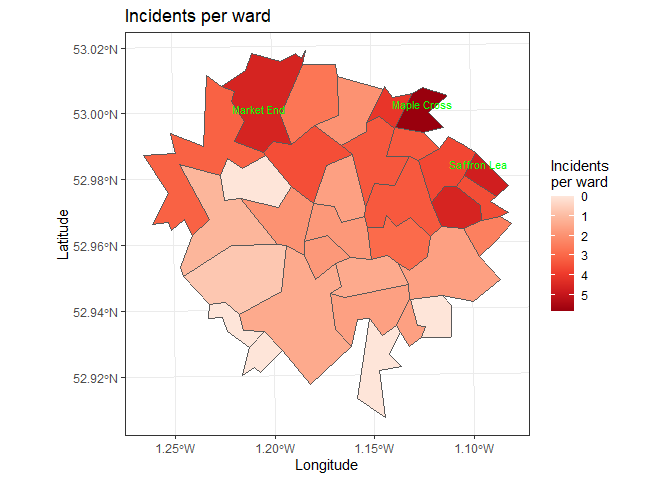
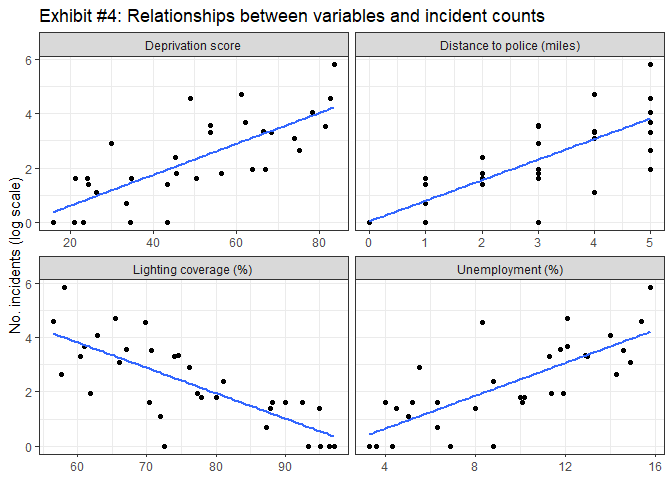
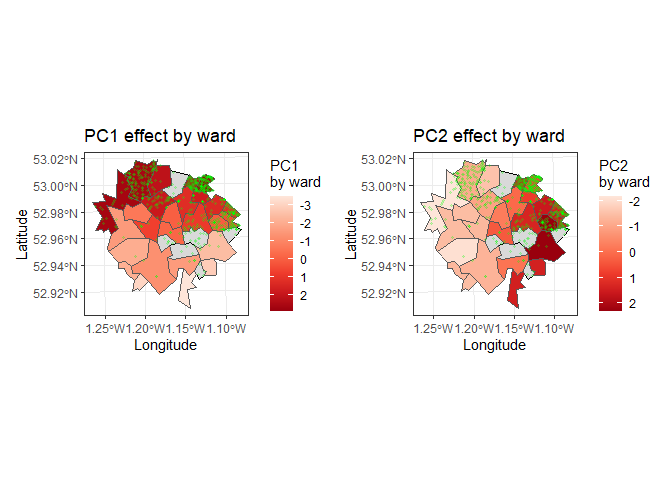

# Coursework 2


<!--- DO NOT DELETE THIS LINE --->

<!--- METADATA ANCHOR: MA22019-CW2-2026 --->

# Data Preparation Notes

<!--- DO NOT DELETE THIS LINE - DATA PREPARATION NOTES ANCHOR --->

Briefly document the main data-handling decisions that matter for your
analysis. This section may be short prose or one small table.

``` r
# Write your data-preparation code here.

library(tidyverse)
library(sf)
library(ggspatial)
library(prettymapr)
library(patchwork)
library(spatstat)
library(janitor)

city_wards <- read_sf("data/city_wards.shp")
ward_profiles <- read.csv("data/ward_profiles.csv")
incident_reports <- read.csv("data/incident_reports.csv")

ward_profiles <- ward_profiles %>% 
  mutate(ward_name = gsub("-", " ", ward_name)) %>% 
  mutate(rental_share = as.numeric(gsub("%","",rental_share)))

city_wards_profiles <- city_wards %>% 
  left_join(ward_profiles, by = c("ward_id", "ward_name"))

cat("Total wards in city:", nrow(city_wards),"\n")
```

    Total wards in city: 32 

``` r
ward_profiles_missing <- ward_profiles %>% 
  summarise(across(everything(), ~sum(is.na(.))))

incident_sf <- st_as_sf(incident_reports, coords = c("x", "y"), crs = st_crs(city_wards_profiles)) #turn the coords from incident_reports into a sf with the correct coordinate system. then use st_join to join this with the city_wards_profiles outline.

incidents_wards <- st_join(incident_sf, city_wards_profiles)

no_mislabelled_incidents <- incidents_wards %>% 
  filter(ward_name.x != ward_name.y) %>% 
  nrow()    # 39 mislabelled incidents.

cat("No. incident reports with mislabelled wards:", no_mislabelled_incidents, "\n")
```

    No. incident reports with mislabelled wards: 39 

``` r
incidents_wards <- incidents_wards %>% 
  rename(ward_recorded = ward_name.x, correct_ward = ward_name.y)
```

Write your `Data Preparation Notes` answer here.

I checked the data for inconsistent formatting in any variables. I found
that ward_name is inconsistent, as some have hyphens in ward_profiles
but not in city_wards. I also found that rental_share in ward_profiles
is inconsistent as some values have % signs and some don’t. I removed
these and asserted that the value was numeric. I found that in
ward_profiles there are in 3 missing values in transport_access and 3
missing values in listed_building_share. I have left these in so we
don’t lose data unnecessarily, but will have to deal with them when
doing analysis of these variables. I joined the ward geometries and
profiles so that each ward has its info included. I used left_join so
that all the info from ward_profiles is added to each ward, without risk
of losing any. I joined by ward_id and ward_name as I had already
cleaned these so they should match up, and I didn’t want columns to
duplicate unnecessarily. incident_reports showed no duplicated entries.
I double-checked whether the labels for ward lined up with the
coordinates given. After converting incident reports to sf and joining
to city_wards_profiles I found that 39 entries did not line up. I
decided to trust the coordinates given rather than the label, as they
are more likely to be accurate, especially for incidents happening on
borders which have been mislabelled.

- ward_name is inconsistently formatted, some have hyphens in
  ward_profiles
- city_wards and ward_profiles both have 32 unique rows, so this is
  consistent, i checked all names now match up
- I also checked all the ward_names in incident_reports are formatted
  the same and match up
- In ward_profiles, rental_share is inconsistently formatted. i have
  removed % signs and made the values numeric.
- in ward_profiles there are 3 missing values in transport_access and 3
  missing values in listed_building_share. These are kept in but will be
  removed before doing analysis on those variables
- incident_reports and city_wards are both free of missing values
- no duplicates in incident_reports
- i checked consistency between coordinates and labels in
  incident_reports. i found 39 incidents which had labels which are not
  consistent with the coordinates given.
- i renamed the ward in which it was recorded as ward_recorded and the
  ward it lies in by coordinates as correct_ward.
- i am trusting the coordinates to be more accurate as labels may have
  been put in incorrectly, or the place lies on the border and they were
  labelled incorrectly
- i joined the ward_profiles to the city_wards using left_join, so that
  each ward has its relevant info and geometry. i joined by ward_id and
  ward_name as i already cleaned these to be the same, and i didnt want
  columns to duplicate

# Task 1

<!--- DO NOT DELETE THIS LINE - TASK 1 ANCHOR --->

Identify and investigate the most important spatial patterns in the
incident data.

``` r
# Write your Task 1 code here.

incidents_per_ward <- incidents_wards %>% 
  st_drop_geometry() %>% 
  count(correct_ward, name = "n_incidents")

top_incidents_per_ward <- incidents_per_ward %>% 
  arrange(desc(n_incidents)) %>% 
  head(8)

incidents_per_ward_plot <- top_incidents_per_ward %>% 
  ggplot(aes(x = reorder(correct_ward, n_incidents), y = n_incidents)) +
  geom_col(fill = "violet") +
  coord_flip() +
  labs(
    x = "Ward",
    y = "Number of incidents",
    title = "Top 8 wards by incident count") +
  theme_minimal()

spatial_distribution_incidents <- incidents_wards %>% 
  ggplot()+
  geom_sf(data = city_wards, fill = "grey98", colour = "black")+
  geom_sf(data = incidents_wards, alpha = 0.6, size = 0.6, colour = "black")+
  theme_bw()+
  labs(title = "Spatial distribution of incident reports", x = "Longitude", y = "Latitude")

incidents_per_ward_plot + spatial_distribution_incidents
```


``` r
incident_ppp <- ppp(
  st_coordinates(incidents_wards)[,1],
  st_coordinates(incidents_wards)[,2],
  window = as.owin(city_wards))

density_map <- density.ppp(incident_ppp, edge = TRUE, sigma = 3000)
plot(density_map, main = "Kernel-smoothed density of incidents")
```


``` r
areas_counts <- city_wards_profiles %>% 
  left_join(incidents_per_ward, by = c("ward_name" = "correct_ward")) %>% 
  mutate(n_incidents = replace_na(n_incidents, 0))

top_ward <- areas_counts %>% 
  slice_max(n_incidents, n = 1)

choropleth_map1 <- areas_counts %>% 
  ggplot(aes(fill = n_incidents)) +
    geom_sf() +
    geom_sf_text(data = top_ward, aes(label = ward_name), size = 3, vjust = -1.8, hjust = -0.05)+
    theme_bw() +
    scale_fill_distiller(palette = "Reds", trans = "reverse") +
    labs(
        x = "Longitude", y = "Latitude",
        fill = "Incidents\nper ward",
        title = "Incidents per ward")
choropleth_map1
```



Write your Task 1 answer here.

I first grouped by ward and computed the number of incidents per ward. I
found that there was significant variation between wards, with some
wards such as “Canal Side” having no incidents, and others have many
incidents such as “Maple Cross” with 337. I plotted the spatial
distribution of incidents, and found that there was a significant
North-South divide, with the majority of incidents taking place in the
North of the city. More specifically, the North-East was the most
incident-heavy region. I plotted the kernel-smoothed incident density to
visualise the pattern of expected number of incidents. Again it was
clear that most of the incidents occured in the north-east. I plotted a
choropleth map to give a better visualisation of which wards suffered
the most incidents. Maple Cross was the most significant in terms of
incident frequency and, while we also see some hotspots in the east and
North-west.

# Task 2

<!--- DO NOT DELETE THIS LINE - TASK 2 ANCHOR --->

Use the available neighbourhood data to develop and justify possible
explanations for the patterns you identified.

``` r
# Write your Task 2 code here.


correlation_matrix <- areas_counts %>% 
  st_drop_geometry() %>% 
  select(n_incidents, unemployment_rate, deprivation_score, rental_share,
         population_density, transport_access, lighting_coverage,
         distance_police_hub, listed_building_share) %>% 
  cor(use = "complete.obs")

incident_correlations <- tibble(
  variable = names(correlation_matrix["n_incidents", ]),
  correlation = as.numeric(correlation_matrix["n_incidents", ])) %>% 
  arrange(desc(correlation))

pca_data <- areas_counts %>% 
  st_drop_geometry() %>% 
  select(unemployment_rate, deprivation_score, rental_share,
         population_density, transport_access, lighting_coverage,
         distance_police_hub, listed_building_share) %>% 
  drop_na()

pca_result <- prcomp(pca_data, scale = TRUE)
var_explained <- pca_result$sdev^2 / sum(pca_result$sdev^2)
cumsum(var_explained)[1:5]
```

    [1] 0.4824495 0.7459098 0.8722910 0.9660204 0.9955581

``` r
scree_df <- data.frame(
    PC  = seq_along(var_explained),
    Var = var_explained)

ggplot(scree_df[1:8, ], aes(x = PC, y = Var)) +
    geom_col(fill = "steelblue") +
    geom_line(aes(y = cumsum(Var)[1:8]), color = "red", linewidth = 1) +
    geom_point(aes(y = cumsum(Var)[1:8]), color = "red", size = 2) +
    geom_hline(yintercept = 0.9, linetype = "dashed") +
    scale_y_continuous(labels = scales::percent_format()) +
    theme_bw() +
    labs(
        x = "Principal Component", y = "Variance Explained",
        title = "Scree Plot"
    )
```



``` r
pcas <- pca_result$rotation

areas_counts_pca <- areas_counts %>% 
  drop_na()

areas_counts_pca$pca1 <- pca_result$x[,1]

choropleth_map2 <- areas_counts_pca %>% 
  ggplot(aes(fill = pca1)) +
  geom_sf(data = areas_counts, fill = "grey85", colour = "black", linewidth = 0.25)+
    geom_sf() +
    theme_bw() +
    scale_fill_distiller(palette = "Reds", trans = "reverse") +
    labs(
        x = "Longitude", y = "Latitude",
        fill = "PC1\nby ward",
        title = "PC1 effect by ward")

choropleth_map2
```



Write your Task 2 answer here.

- I created a correlation matrix to see if any variables were highly
  correlated with number of incidents
- i deciphered that unemployment rate deprivation score both had 0.49
  correlation with number of incidents, so these could be worth
  investigating.

# Task 3

<!--- DO NOT DELETE THIS LINE - TASK 3 ANCHOR --->

Make a small number of evidence-based recommendations for priority areas
or actions.

``` r
# Write your Task 3 code here.
```

Write your Task 3 answer here.

# References

<!--- DO NOT DELETE THIS LINE - REFERENCES ANCHOR --->

Add references only if needed.

    **Prose Word Count:** 747 words (253 words under the 1000-word limit)
