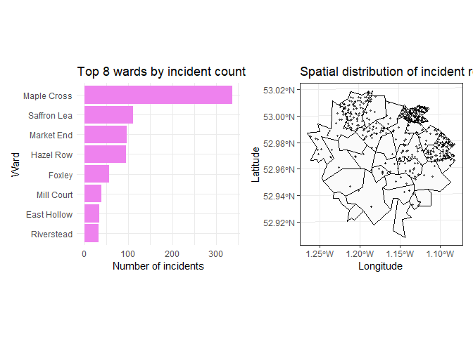

# Coursework 2


<!--- DO NOT DELETE THIS LINE --->

<!--- METADATA ANCHOR: MA22019-CW2-2026 --->

# Data Preparation Notes

<!--- DO NOT DELETE THIS LINE - DATA PREPARATION NOTES ANCHOR --->

Briefly document the main data-handling decisions that matter for your
analysis. This section may be short prose or one small table.

``` r
# Write your data-preparation code here.

library(tidyverse)
library(sf)
library(ggspatial)
library(prettymapr)
library(patchwork)
library(spatstat)
library(janitor)

city_wards <- read_sf("data/city_wards.shp")
ward_profiles <- read.csv("data/ward_profiles.csv")
incident_reports <- read.csv("data/incident_reports.csv")

ward_profiles <- ward_profiles %>% 
  mutate(ward_name = gsub("-", " ", ward_name)) %>% 
  mutate(rental_share = as.numeric(gsub("%","",rental_share)))

city_wards_profiles <- city_wards %>% 
  left_join(ward_profiles, by = c("ward_id", "ward_name"))

cat("Total wards in city:", nrow(city_wards),"\n")
```

    Total wards in city: 32 

``` r
ward_profiles_missing <- ward_profiles %>% 
  summarise(across(everything(), ~sum(is.na(.))))

incident_sf <- st_as_sf(incident_reports, coords = c("x", "y"), crs = st_crs(city_wards_profiles)) #turn the coords from incident_reports into a sf with the correct coordinate system. then use st_join to join this with the city_wards_profiles outline.

incidents_wards <- st_join(incident_sf, city_wards_profiles)

no_mislabelled_incidents <- incidents_wards %>% 
  filter(ward_name.x != ward_name.y) %>% 
  nrow()    # 39 mislabelled incidents.

cat("No. incident reports with mislabelled wards:", no_mislabelled_incidents, "\n")
```

    No. incident reports with mislabelled wards: 39 

``` r
incidents_wards <- incidents_wards %>% 
  rename(ward_recorded = ward_name.x, correct_ward = ward_name.y)
```

Write your `Data Preparation Notes` answer here.

I checked the data for inconsistent formatting in any variables. I found
that ward_name is inconsistent, as some have hyphens in ward_profiles
but not in city_wards. I also found that rental_share in ward_profiles
is inconsistent as some values have % signs and some don’t. I removed
these and asserted that the value was numeric. I found that in
ward_profiles there are in 3 missing values in transport_access and 3
missing values in listed_building_share. I have left these in so we
don’t lose data unnecessarily, but will have to deal with them when
doing analysis of these variables. I joined the ward geometries and
profiles so that each ward has its info included. I used left_join so
that all the info from ward_profiles is added to each ward, without risk
of losing any. I joined by ward_id and ward_name as I had already
cleaned these so they should match up, and I didn’t want columns to
duplicate unnecessarily. incident_reports showed no duplicated entries.
I double-checked whether the labels for ward lined up with the
coordinates given. After converting incident reports to sf and joining
to city_wards_profiles I found that 39 entries did not line up. I
decided to trust the coordinates given rather than the label, as they
are more likely to be accurate, especially for incidents happening on
borders which have been mislabelled.

- ward_name is inconsistently formatted, some have hyphens in
  ward_profiles
- city_wards and ward_profiles both have 32 unique rows, so this is
  consistent, i checked all names now match up
- I also checked all the ward_names in incident_reports are formatted
  the same and match up
- In ward_profiles, rental_share is inconsistently formatted. i have
  removed % signs and made the values numeric.
- in ward_profiles there are 3 missing values in transport_access and 3
  missing values in listed_building_share. These are kept in but will be
  removed before doing analysis on those variables
- incident_reports and city_wards are both free of missing values
- no duplicates in incident_reports
- i checked consistency between coordinates and labels in
  incident_reports. i found 39 incidents which had labels which are not
  consistent with the coordinates given.
- i renamed the ward in which it was recorded as ward_recorded and the
  ward it lies in by coordinates as correct_ward.
- i am trusting the coordinates to be more accurate as labels may have
  been put in incorrectly, or the place lies on the border and they were
  labelled incorrectly
- i joined the ward_profiles to the city_wards using left_join, so that
  each ward has its relevant info and geometry. i joined by ward_id and
  ward_name as i already cleaned these to be the same, and i didnt want
  columns to duplicate

# Task 1

<!--- DO NOT DELETE THIS LINE - TASK 1 ANCHOR --->

Identify and investigate the most important spatial patterns in the
incident data.

``` r
# Write your Task 1 code here.


incidents_wards %>% 
  ggplot()+
  geom_sf(data = city_wards)+
  geom_sf(aes(colour = unemployment_rate), data = incidents_wards)
```



``` r
incidents_wards %>% 
  ggplot()+
  geom_sf(data = city_wards)+
  geom_sf(aes(colour = deprivation_score), data = incidents_wards)
```


``` r
cor(incidents_wards$unemployment_rate, incidents_wards$deprivation_score)
```

    [1] 0.9779709

``` r
incidents_wards
```

    Simple feature collection with 987 features and 14 fields
    Geometry type: POINT
    Dimension:     XY
    Bounding box:  xmin: 449742.4 ymin: 337366.6 xmax: 461778.5 ymax: 347033.8
    Projected CRS: OSGB36 / British National Grid
    First 10 features:
       incident_id ward_recorded       date
    1     INC_0001    Riverstead 2025-09-21
    2     INC_0002    Riverstead 2025-09-25
    3     INC_0003    Riverstead 2025-05-05
    4     INC_0004    Riverstead 2025-02-12
    5     INC_0005    Riverstead 2025-07-20
    6     INC_0006    Riverstead 2025-07-04
    7     INC_0007    Riverstead 2025-04-06
    8     INC_0008    Riverstead 2025-12-01
    9     INC_0009    Riverstead 2025-09-30
    10    INC_0010    Riverstead 2025-06-18
                                                                                      description
    1    Report noted repeated damage to bins and surrounding fixtures. Nearby property affected.
    2           Damage reported to fencing and nearby street furniture. Nearby property affected.
    3          Damage reported to fencing and nearby street furniture. Possible overnight timing.
    4                            Graffiti and minor vandalism observed on public-facing property.
    5                            Graffiti and minor vandalism observed on public-facing property.
    6         Broken glass and signs of overnight damage were recorded. Nearby property affected.
    7                                              Repeated late-night noise reported near flats.
    8  Street-safety report logged after repeated uneasy encounters. Pedestrian route referenced.
    9                          Residents described persistent disturbance from street gatherings.
    10          Damage reported to fencing and nearby street furniture. Nearby property affected.
       ward_id correct_ward unemployment_rate deprivation_score rental_share
    1      W02   Riverstead              14.6             81.39         67.5
    2      W02   Riverstead              14.6             81.39         67.5
    3      W02   Riverstead              14.6             81.39         67.5
    4      W02   Riverstead              14.6             81.39         67.5
    5      W02   Riverstead              14.6             81.39         67.5
    6      W02   Riverstead              14.6             81.39         67.5
    7      W02   Riverstead              14.6             81.39         67.5
    8      W02   Riverstead              14.6             81.39         67.5
    9      W02   Riverstead              14.6             81.39         67.5
    10     W02   Riverstead              14.6             81.39         67.5
       population_density transport_access lighting_coverage distance_police_hub
    1                6057             48.6              70.6                   3
    2                6057             48.6              70.6                   3
    3                6057             48.6              70.6                   3
    4                6057             48.6              70.6                   3
    5                6057             48.6              70.6                   3
    6                6057             48.6              70.6                   3
    7                6057             48.6              70.6                   3
    8                6057             48.6              70.6                   3
    9                6057             48.6              70.6                   3
    10               6057             48.6              70.6                   3
       listed_building_share                  geometry
    1                   24.3 POINT (454223.5 343867.6)
    2                   24.3 POINT (455220.4 342344.2)
    3                   24.3   POINT (454525.9 343659)
    4                   24.3   POINT (454919 343857.1)
    5                   24.3 POINT (455045.4 343545.5)
    6                   24.3 POINT (454102.6 343375.6)
    7                   24.3 POINT (454903.9 343139.3)
    8                   24.3 POINT (455853.4 343745.8)
    9                   24.3 POINT (454869.9 343420.6)
    10                  24.3   POINT (454318 343134.8)

Write your Task 1 answer here.

# Task 2

<!--- DO NOT DELETE THIS LINE - TASK 2 ANCHOR --->

Use the available neighbourhood data to develop and justify possible
explanations for the patterns you identified.

``` r
# Write your Task 2 code here.
```

Write your Task 2 answer here.

# Task 3

<!--- DO NOT DELETE THIS LINE - TASK 3 ANCHOR --->

Make a small number of evidence-based recommendations for priority areas
or actions.

``` r
# Write your Task 3 code here.
```

Write your Task 3 answer here.

# References

<!--- DO NOT DELETE THIS LINE - REFERENCES ANCHOR --->

Add references only if needed.

    **Prose Word Count:** 559 words (441 words under the 1000-word limit)
